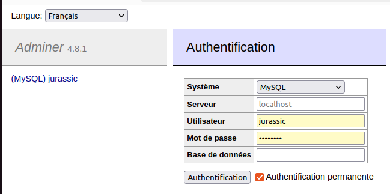
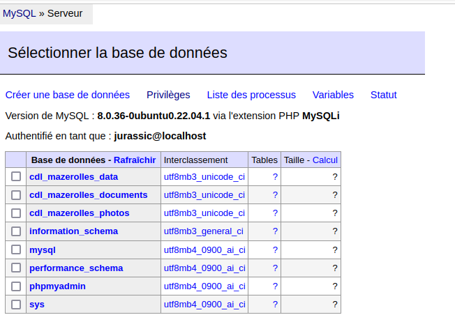
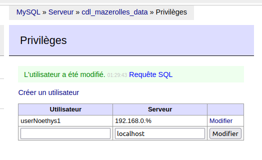
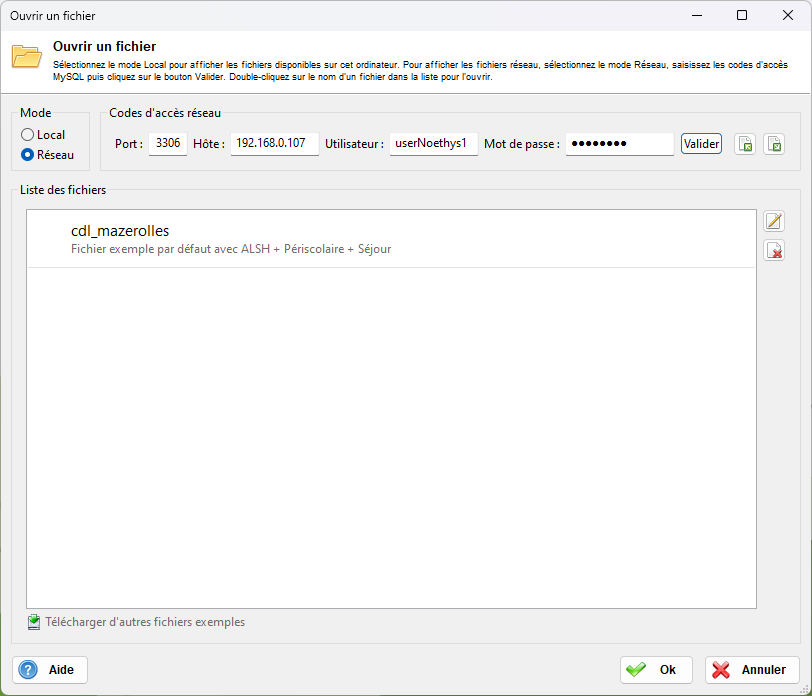
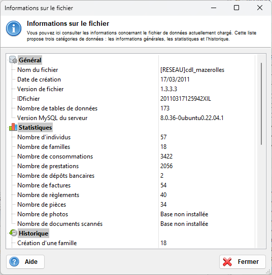

Noethys
==================
Logiciel de gestion libre et gratuit de gestion multi-activités pour 
les accueils de loisirs, crèches, garderies périscolaires, cantines, 
TAP ou NAP, clubs sportifs et culturels...

Plus d'infos sur www.noethys.com


Installation sur Windows
------------------

Allez dans la rubrique Téléchargements du site www.noethys.com pour télécharger la version compilée pour Windows.


Installation sur Ubuntu 22.04 pour du python 3.10
------------------

Lancez dans votre console Linux les commandes suivantes :
```
sudo apt-get install git curl libsdl2-mixer-2.0-0 libsdl2-image-2.0-0 libsdl2-2.0-0 python3-pip python3-pyscard python3-dev default-libmysqlclient-dev build-essential
pip3 install -U -f https://extras.wxpython.org/wxPython4/extras/linux/gtk3/ubuntu-22.04 wxPython
git clone https://github.com/JurassicPork/Noethys
pip3 install -r Noethys/requirements.txt
python3 Noethys/noethys/Noethys.py
```

Installation de mysql 8.0 
------------------
Lancez dans votre console Linux la commande suivante :
```
sudo apt-get install mysql-client mysql-server python3-mysql.connector python3-mysqldb python3-pymysql
```

cette commande installe aussi les fichiers python pour mysql (plus besoin de mettre mysql dans les requirements)

Il faut configurer mysql pour qu'il soit accessible depuis noethys ( user password adresses réseau).

Il y a ici [installing_mysql_workbench_ubuntu](https://linuxhint.com/installing_mysql_workbench_ubuntu/) un tutoriel en angliche pour configurer mysql sur un Ubuntu 22.04

voici un exemple de configuration (ici j'utilise **adminer** au lieu de **mysql-workbench**) :

côté serveur : 

utilisation de **adminer** pour gérer mysql



visualisation des bases de données (les bases commençant par cdl ont été créées par **Convertir en fichier réseau** dans Noethys) :




visualisation des utilisateurs pour une des bases de données Noethys :



côté client :

ouvrir un fichier réseau côté Noethys :




Infos sur le fichier réseau :


